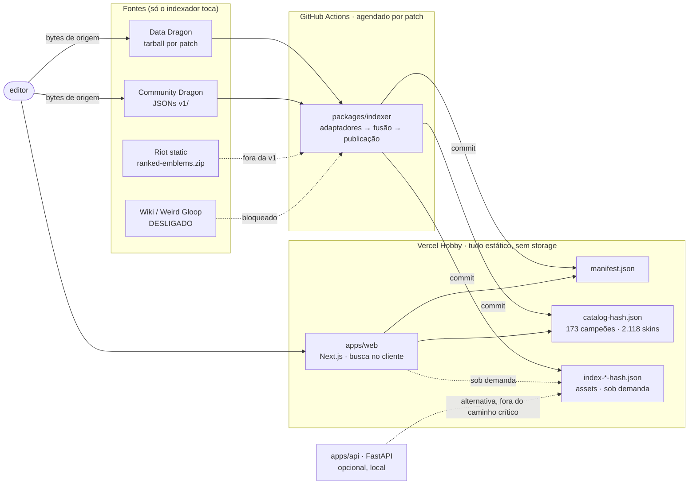
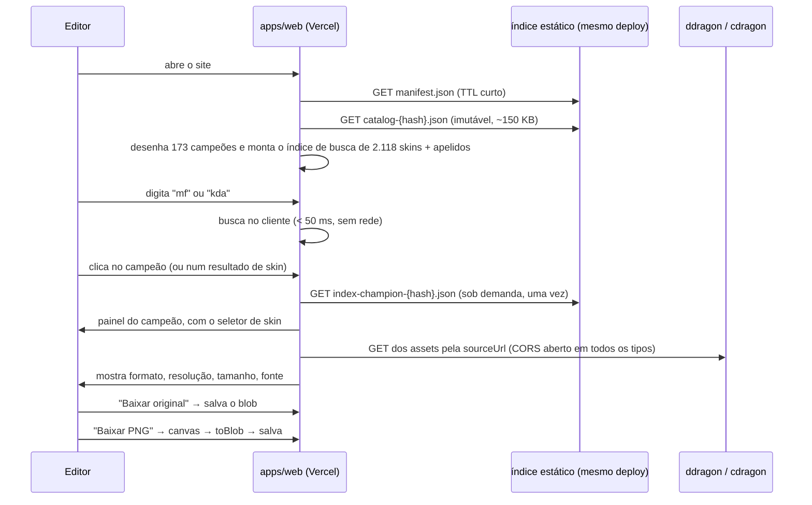
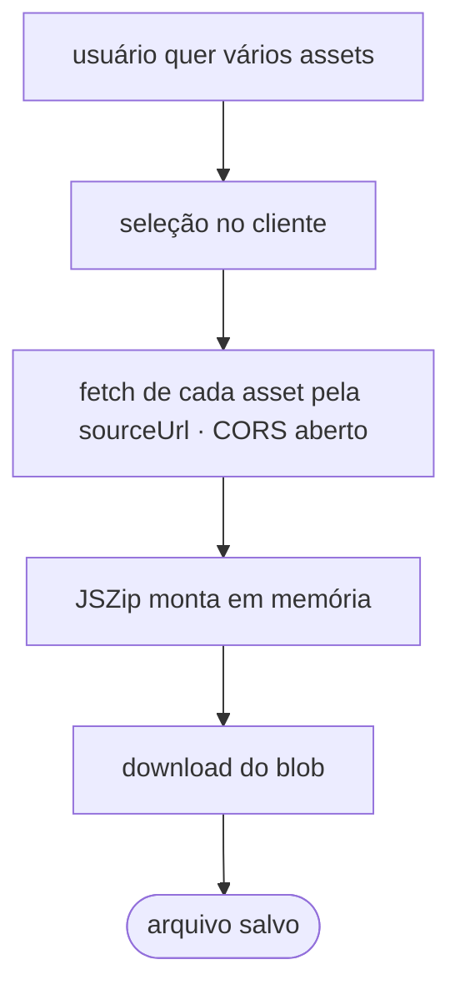

# SPEC v1 — catálogo de assets visuais de League of Legends

> Etapa 4 das 7. Escrita a partir de [`KICKOFF.md`](KICKOFF.md), dos números reais de
> [`SPIKES.md`](SPIKES.md), dos nove [ADRs](adr/README.md) e do que o protótipo do bloco 3
> ensinou. **Esta Spec tem precedência sobre o KICKOFF** (regra 1 do
> [CLAUDE.md](../CLAUDE.md)); os ADRs têm precedência sobre ela nos pontos que decidem.
>
> Data: 03/09/2026 · patch de referência: 16.17.1 · contrato do índice: `1.1.0`
>
> **Revisão de 09/09/2026:** a primeira indexação com **as duas fontes e as oito
> categorias** mediu 18,1 MB e bateu no teto de 15 MiB do RNF-05, sem escrever nada. O teto
> subiu para 24 MiB — [ADR 0015](adr/0015-orcamento-do-indice-depois-da-segunda-fonte.md).
> Mantê-lo custaria chroma (RF-06), emote ou ward; mudá-lo custa bytes de clone que o
> [ADR 0014](adr/0014-onde-vive-o-indice-gerado.md) já mediu e aceitou nessa ordem de
> grandeza. **D4 fecha com "sim"**: emotes e wards entram na v1.
>
> **Revisão de 08/09/2026:** o índice guarda **uma versão só, a corrente** —
> [ADR 0013](adr/0013-uma-versao-por-vez-no-indice.md), que emenda o
> [ADR 0007](adr/0007-politica-de-versoes-e-orcamento.md). **RF-19 e RF-20 saem da v1**:
> guardar histórico custa 4,4 MB por patch, ~115 MB/ano num repositório que todo clone
> paga, e entrega ícones repetidos — splash, loading, tile e runas não existem em versão
> antiga. Consequência direta da opção B do ADR 0012: com bucket, a decisão seria outra.
>
> **Revisão de 07/09/2026:** o projeto passa a operar **sem storage próprio** —
> [ADR 0012](adr/0012-onde-guardar-os-assets.md), que emenda os ADRs 0005 e 0007. O índice
> aponta para as URLs das fontes. **RF-16 e a categoria `rank` saem da v1**; RNF-05 e
> RNF-07 foram reescritos para dizer o que a arquitetura realmente entrega.
>
> **Revisão de 03/09/2026:** navegação e busca passam a operar em níveis diferentes —
> ver [ADR 0010](adr/0010-navegacao-por-campeao-busca-por-skin.md), que emenda o
> [ADR 0008](adr/0008-catalogo-de-skins-e-seletor.md). Os requisitos são numerados de
> forma incremental: RF-24 e RF-25 entram no fim para não invalidar as referências
> já feitas em [`TICKETS.md`](TICKETS.md).

---

## 1. Visão e não-objetivos

### 1.1 Visão

Um site estático onde um editor de vídeo de League of Legends acha e baixa qualquer asset
visual do jogo em segundos, sem login, sem instalar nada e sem saber o que é "ddragon".
Uso pessoal e de um pequeno grupo de amigos, custo de operação **zero**, sem monetização.

### 1.2 Não-objetivos da v1

| Fora | Por quê |
|---|---|
| Stats, builds, patch notes, dados de partida | Não é o job to be done (§A.3) |
| Contas, login, favoritos sincronizados | Exige back-end e estado; o site é estático ([ADR 0005](adr/0005-arquitetura-estatica-custo-zero.md)) |
| Edição de imagem (recorte, remoção de fundo, resize) | O usuário já tem Photoshop aberto |
| Upload de assets pelo usuário | Sem back-end e sem moderação |
| Assets de TFT, Wild Rift, Valorant | 634 MB só de TFT, fora do escopo (SPIKES S1) |
| API pública documentada para terceiros | [ADR 0006](adr/0006-api-como-componente-opcional.md) |
| Monetização de qualquer forma | [ADR 0005](adr/0005-arquitetura-estatica-custo-zero.md), regra 6 |
| Assets da wiki | Bloqueado até consentimento ([ADR 0004](adr/0004-consentimento-da-wiki-e-teto-de-resolucao.md)) |
| Splash, loading e tile de versões antigas | Fisicamente impossível: essas URLs do ddragon não são versionadas ([ADR 0007](adr/0007-politica-de-versoes-e-orcamento.md)) |
| **Zip por categoria pré-gerado (ex-RF-16)** | Sem storage não há onde pré-gerar ([ADR 0012](adr/0012-onde-guardar-os-assets.md)). O lote existe, mas montado no cliente — ver RF-17 |
| **Emblemas de elo (categoria `rank`)** | O emblema composto só existe dentro do zip de 61,5 MB da Riot; o cdragon tem as peças, não o emblema montado, e compor violaria o [ADR 0001](adr/0001-formato-de-entrega-dos-assets.md) |

---

## 2. Personas e jobs to be done

**Persona única: o editor.** Faz vídeo e thumbnail de LoL, usa Premiere/After
Effects/Photoshop, nível técnico variado. Está no meio de uma edição quando precisa do
asset. Não vai ler nada.

| # | Job to be done | O que a v1 entrega |
|---|---|---|
| J1 | "Preciso do square do Jax pro canto do vídeo" | Busca ou grade → campeão → baixar |
| J2 | "Preciso da splash da skin Jax Deus da Guerra em alta" | Busca pelo nome da skin → abre o painel do campeão já naquela skin → baixar |
| J7 | "Preciso das skins K/DA de vários campeões pra uma thumbnail temática" | Busca por termo transversal → skins de campeões diferentes ([ADR 0010](adr/0010-navegacao-por-campeao-busca-por-skin.md)) |
| J3 | "Preciso de todos os ícones de item pra uma build animada" | Seleção da categoria `item` zipada no cliente (~868 arquivos, ~31 s medidos) |
| ~~J4~~ | ~~"Preciso do ícone de Diamante IV"~~ | **Fora da v1** — ver §1.2 |
| ~~J5~~ | ~~"Esse vídeo é de patch antigo, preciso do square antigo do Aatrox"~~ | **Fora da v1 em 08/09/2026** ([ADR 0013](adr/0013-uma-versao-por-vez-no-indice.md)): o índice guarda uma versão só. A jornada continua real, e o custo de atendê-la está medido no ADR |
| J6 | "Preciso de tudo do Jax" | Seleção no cliente → zip com JSZip |

---

## 3. Requisitos funcionais

Cada RF tem critério de aceite testável. O identificador é citado pelo ticket que o
implementa e pelo teste que o prova.

### Catálogo e busca

| # | Requisito | Critério de aceite |
|---|---|---|
| **RF-01** | A home é a busca, com foco automático e resultados enquanto digita | Ao carregar, `document.activeElement` é o campo de busca; digitar 1 caractere já altera a lista |
| **RF-02** | A busca é tolerante a acento, maiúscula e apóstrofo | `kaisa`→Kai'Sa, `belveth`→Bel'Veth, `chogath`→Cho'Gath, `KAI'SA`→Kai'Sa, todos em 1º lugar |
| **RF-03** | A busca resolve apelidos da tabela mantida à mão | `mf`→Miss Fortune, `tf`→Twisted Fate, `j4`→Jarvan IV, `asol`→Aurelion Sol em 1º lugar |
| **RF-04** | **A navegação padrão é por campeão** — 173 entradas | Sem nada digitado, a grade tem 173 cartões, um por campeão, cada um com a arte da skin base e o número de skins |
| **RF-05** | **A busca opera no nível de skin e também casa campeão**; um campeão casado aparece **uma** vez | `jax` retorna 1 entrada de campeão, não 18 de skin; `deus da guerra` retorna a skin em 1º lugar |
| **RF-06** | Chromas não aparecem como resultado de primeiro nível | Nenhum dos 7.037 chromas aparece na lista; ficam atrás de um toggle dentro da skin, no painel do campeão |
| **RF-07** | Atalho `/` foca a busca sem inserir o caractere | Após `/`, o foco é o campo e o valor não mudou |
| **RF-08** | Navegação por categoria com filtros | Filtros de função, comprável, mapa e árvore de runa alteram a lista. ~~lane~~ e ~~elo~~ **saíram em 09/09/2026** (T-24): nenhuma fonte declara posição, e a categoria `rank` saiu da v1 com o [ADR 0012](adr/0012-onde-guardar-os-assets.md) |
| **RF-24** | **Busca por termo transversal a vários campeões** | `kda` e `prestigio` retornam skins de ≥ 3 campeões distintos, cada resultado rotulado com o campeão de origem |
| **RF-25** | **O seletor de skin vive no painel do campeão** | Abrir um campeão lista as skins dele; clicar num resultado de skin abre o painel do campeão **já com aquela skin selecionada** |

### Asset e download

| # | Requisito | Critério de aceite |
|---|---|---|
| **RF-09** | O card mostra formato, resolução, tamanho e fonte **antes** do download | O card exibe `1280×720 · image/jpeg · 121 KB · ddragon` sem nenhum clique extra |
| **RF-10** | Download individual entrega os **bytes de origem**, sem re-encode | O arquivo baixado é o que a fonte entregou ao navegador, com o formato e as dimensões do índice; nas fontes de bytes estáveis (`isByteStable` — hoje, só o ddragon), também o `sha256` do índice ([ADR 0019](adr/0019-o-sha256-do-cdragon-nao-confere-o-download.md)) |
| **RF-11** | O botão "Baixar PNG" converte no navegador, no clique | O arquivo salvo é `image/png` com as mesmas dimensões; nenhum PNG foi armazenado no bucket |
| **RF-12** | Asset com origem PNG não oferece conversão | O botão aparece desabilitado com rótulo "já é PNG" |
| **RF-13** | Nome de arquivo previsível | `Jax_004_splash_centered.jpg`, `Item_3031.png`, `Rank_Diamond_IV.png` — casa com `^[A-Za-z0-9_.-]+\.(png\|jpg)$` |
| **RF-14** | Copiar URL direta do arquivo | O clipboard recebe a URL pública que responde 200 |
| **RF-15** | Do carregamento ao arquivo salvo: no máximo 3 cliques | Teste e2e conta os cliques do fluxo J1 e J2 e falha em > 3 |

### Lote e versões

| # | Requisito | Critério de aceite |
|---|---|---|
| ~~**RF-16**~~ | ~~Zip por categoria é pré-gerado e baixado direto do bucket~~ | **Removido da v1 em 07/09/2026** ([ADR 0012](adr/0012-onde-guardar-os-assets.md)): sem storage não há onde pré-gerar. O número fica reservado, não reaproveitado |
| **RF-17** | Zip de seleção customizada é montado no cliente — **único caminho de lote** | Selecionar N assets e baixar produz um zip com N arquivos, sem nenhuma requisição a um servidor próprio. Verificado com bytes de terceiros de dois hosts |
| **RF-18** | "Tudo do Jax" é uma seleção pré-montada | Um clique seleciona todos os assets do campeão; o zip sai pelo caminho do RF-17 |
| ~~**RF-19**~~ | ~~Seletor de versão, com a atual por padrão~~ | **Removido da v1 em 08/09/2026** ([ADR 0013](adr/0013-uma-versao-por-vez-no-indice.md)): o índice guarda uma versão só, então não há o que selecionar. O número fica reservado |
| ~~**RF-20**~~ | ~~Em versão anterior, tipos indisponíveis são explicitamente ausentes~~ | **Removido da v1 em 08/09/2026** pelo mesmo ADR: sem versão anterior, não há tipo ausente a explicar. A regra que o motivava — splash, loading e tile não são versionados — continua verdadeira e registrada no [ADR 0007](adr/0007-politica-de-versoes-e-orcamento.md) |

### Institucional

| # | Requisito | Critério de aceite |
|---|---|---|
| **RF-21** | Aviso legal da Riot visível | O texto está no rodapé de toda página; teste falha se sumir |
| **RF-22** | Página "Sobre" com créditos, licenças e fontes | Cita Riot, ddragon, cdragon e — se autorizado — a wiki/Weird Gloop |
| **RF-23** | O nome exibido não contém "Riot", "League of Legends" nem "LoL" | Teste já existente em `site-config.test.ts` |

---

## 4. Requisitos não funcionais

| # | Requisito | Meta mensurável | Como se mede |
|---|---|---|---|
| **RNF-01** | Busca responde rápido | < 50 ms do keystroke ao render, com 173 campeões e 2.118 skins no índice | `performance.measure` no e2e |
| **RNF-02** | Imagem abre rápido | < 1 s para a prévia da splash em conexão de banda larga | e2e com timing |
| **RNF-03** | Carga inicial enxuta | **Catálogo ≤ 150 KB comprimido** (é o único documento pesado da abertura); fatia de assets ≤ 1,5 MB comprimida e carregada **sob demanda** | Falha o build se qualquer um passar |
| **RNF-04** | Custo de operação | **R$ 0,00/mês**: Vercel Hobby + Actions em repo público. **Sem storage e sem conta a manter** ([ADR 0012](adr/0012-onde-guardar-os-assets.md)) | Não há painel de cobrança a revisar |
| **RNF-05** | Armazenamento | **Nenhum asset é armazenado.** O repositório carrega o índice de **uma versão só**: **18,1 MB medidos** no patch 16.17.1 com as duas fontes e as oito categorias ([ADR 0013](adr/0013-uma-versao-por-vez-no-indice.md), [ADR 0015](adr/0015-orcamento-do-indice-depois-da-segunda-fonte.md)) | O indexador falha se o índice passar de 24 MiB; o manifesto tem exatamente uma versão |
| **RNF-06** | Atualização | Novo patch refletido em ≤ 24 h, sem intervenção | Workflow agendado + `status.json` |
| **RNF-07** | Resiliência **degradada, e assumida** | Se ddragon/cdragon caírem, **as imagens não carregam** — o catálogo e a busca continuam, porque são estáticos do app. O site diz que a fonte está fora, em vez de mostrar quadrado quebrado | e2e com as fontes bloqueadas: busca funciona, imagem mostra estado de erro |
| **RNF-08** | Etiqueta de rede | User-Agent identificado, concorrência ≤ 4, backoff em 429/5xx | Teste unitário do cliente HTTP |
| **RNF-09** | Wiki | Zero requisições enquanto `WIKI_CONSENT_GRANTED` for falso | Trava em código que levanta exceção |
| **RNF-13** | Integridade **verificável, não garantida** | O `sha256` do índice descreve os bytes **medidos na indexação**, na origem. Como quem serve é a fonte, ele não garante o que chega ao navegador — e não bloqueia nada. Quem verifica é a **conferência no navegador contra o site no ar** (`conferir:navegador`): o `sha256` nas fontes de bytes estáveis, formato e dimensões nas outras ([ADR 0019](adr/0019-o-sha256-do-cdragon-nao-confere-o-download.md)). **Emendado em 16/09/2026:** o aviso na tela a cada download saiu, por decisão do dono — só valeria para o ddragon, que diverge por horas entre um patch e a reindexação (T-50b) | `conferir:navegador` passa contra a URL publicada |
| **RNF-10** | Legal | Aviso da Riot visível; produto registrado no Developer Portal antes do lançamento | Checklist de lançamento |
| **RNF-11** | Acessibilidade | Navegável por teclado, contraste AA, `alt` em toda imagem; primitivas acessíveis via Radix ([ADR 0011](adr/0011-base-de-componentes-do-front.md)) | axe no e2e |
| **RNF-12** | Qualidade | ruff, ruff format, mypy strict, pytest, eslint, tsc, vitest verdes em todo PR | CI |

---

## 5. Arquitetura

### 5.1 Visão geral



**A linha que define o projeto** era "o tráfego do usuário nunca toca a Riot". O
[ADR 0012](adr/0012-onde-guardar-os-assets.md) trocou isso conscientemente: nesta escala —
o dono e uns poucos amigos — poupar as fontes não vale um cartão de crédito. O que
**continua** valendo é a outra metade: **o tráfego do usuário nunca toca um servidor
nosso**, porque não existe nenhum.

### 5.2 Componentes

| Componente | Responsabilidade | Não faz |
|---|---|---|
| `packages/indexer` | Baixar, **medir**, fundir, nomear e escrever o índice | Nunca converte imagem e, desde o [ADR 0012](adr/0012-onde-guardar-os-assets.md), **nunca copia**: baixa para medir e descarta os bytes |
| `packages/schema` | JSON Schema do índice, tipos TS, modelos Pydantic, tabela de apelidos | Nada de runtime |
| `apps/web` | Busca, navegação, preview, download, conversão PNG, zip de seleção | Nunca chama a Riot nem exige a API |
| `apps/api` | Alternativa opcional de portfólio | Nada do que o site precisa ([ADR 0006](adr/0006-api-como-componente-opcional.md)) |

### 5.3 Fluxo de indexação

```mermaid
sequenceDiagram
    participant A as GitHub Actions
    participant D as ddragon
    participant C as cdragon
    participant P as Pillow
    participant R as repositório

    A->>D: GET /api/versions.json
    A->>A: versão nova? senão carimba checkedAt (1×/dia, ADR 0018) e encerra
    A->>D: GET dragontail-{v}.tgz (2,39 GB, 1 requisição — para MEDIR, não para copiar)
    A->>A: extrai só data/{pt_BR,en_US} e os img/ do escopo
    A->>C: GET v1/champions/{key}.json (concorrência ≤ 4)
    Note over A,C: só caminhos declarados no JSON; nunca montados à mão
    A->>P: mede width, height, format, hasAlpha, sha256
    A->>A: fusão por (identidade, tipo) → nomes canônicos
    A->>A: projeta o catálogo: 173 campeões e 2.118 skins, sem asset
    A->>A: valida contra o JSON Schema; falha aborta tudo
    A->>R: escreve catálogo e fatias do índice em apps/web/public
    A->>R: escreve manifest.json (último passo)
    A->>A: escreve status.json e o resumo do job
    A->>R: commit e push — o deploy da Vercel publica
```

**Ordem importa, mesmo sem bucket:** o `manifest.json` continua sendo o **último** a ser
escrito e o **primeiro** a ser lido. Com o índice no repositório a atomicidade passa a ser
do commit — ou o deploy inteiro entra, ou nenhum entra —, o que é uma garantia mais forte
do que a ordem dava no bucket. A trava de ordem do T-06 fica valendo mesmo assim: ela
impede que uma fatia referencie asset que não existe.

### 5.4 Fluxo de consulta



### 5.5 Fluxo de download em lote



O ramo do zip pré-gerado deixou de existir: o
[ADR 0012](adr/0012-onde-guardar-os-assets.md) tirou o RF-16 da v1. O caminho do cliente foi
**verificado** com bytes de dois hosts diferentes — 5 arquivos, zip relido, bytes
preservados.

**Limite prático:** acima de 300 arquivos ou 500 MB de seleção, a UI **avisa** que a
montagem vai demorar e mostra progresso. Continua sendo aviso, não bloqueio — mas agora não
há alternativa pronta para oferecer, então o aviso precisa ser honesto sobre o tempo.
Medido: ~28 arquivos/s, o que põe a categoria `item` (868) em torno de **31 s** e a de
ícones de perfil (5.042) em torno de **3 minutos**, com meio GB em memória. (Esta linha
dizia "3 minutos e meio" até 09/09/2026; o número não saía da taxa declarada logo acima, e
foi corrigido no T-25 junto com o teste que o calcula.)

---

## 6. Contrato do índice

Fonte de verdade: [`packages/schema/schemas/`](../packages/schema/schemas/).
Versão do contrato: **1.3.0**. Mudança exige ADR e nova versão — o `1.1.0` acrescentou o
`index-status`, o `1.2.0` acrescentou a **assinatura de geração** do manifesto (T-38), e o
`1.3.0`, o **carimbo de verificação** `checkedAt`
([ADR 0018](adr/0018-aviso-mede-a-ultima-verificacao.md), T-51).

| Arquivo | Papel |
|---|---|
| `index-manifest.schema.json` | O `manifest.json` — único arquivo de nome fixo do índice |
| `catalog.schema.json` | **Projeção de navegação (173 campeões) e de busca (2.118 skins)**, sem nenhum asset. É o único documento pesado da abertura ([ADR 0010](adr/0010-navegacao-por-campeao-busca-por-skin.md)) |
| `index-shard.schema.json` | Uma fatia de **assets** por categoria e versão, com `$defs.asset`. Carregada sob demanda |
| `data/champion-aliases.json` | Apelidos de busca, mantidos à mão ([ADR 0009](adr/0009-apelidos-de-busca-mantidos-a-mao.md)) |

O registro de asset carrega `id`, `type` (nome canônico), `category`, as chaves de
identidade (`championKey`, `championId`, `skinId`, `skinNum`, `itemId`, `refId`), `names`
por idioma, `aliases`, `tags`, `source`, `sourceUrl`, `storageKey` (opcional), `fileName`,
`width`, `height`, `format`, `hasAlpha`, `bytes` e `sha256`.

`bytes` e `sha256` são do arquivo que o indexador recebeu. Só conferem o download nas fontes
de bytes estáveis — `BYTE_STABLE_SOURCES` no contrato TypeScript, hoje só o ddragon
([ADR 0019](adr/0019-o-sha256-do-cdragon-nao-confere-o-download.md)).

Duas regras estão **no schema**, não só na prosa, e há teste que prova cada uma:

- `hasAlpha: true` obriga `format: "png"` — JPEG não carrega alfa ([ADR 0001](adr/0001-formato-de-entrega-dos-assets.md) regra 4).
- Assets de corte de splash exigem `skinId` e `skinNum`.

### 6.1 Ordem de carga e fatiamento

Três camadas, carregadas nesta ordem:

0. **Onde isso mora:** os três documentos são arquivos estáticos servidos pelo próprio app
   na Vercel, gerados pelo indexador e versionados no repositório
   ([ADR 0012](adr/0012-onde-guardar-os-assets.md)). Não há bucket.
1. **`manifest.json`** — nome fixo, TTL curto. Diz qual é a versão atual e onde está tudo.
2. **`catalog-{hash}.json`** — as duas projeções do [ADR 0010](adr/0010-navegacao-por-campeao-busca-por-skin.md):
   `champions[]` para navegar e `skins[]` para buscar. Sem asset, sem hash de arquivo, sem
   URL de origem. É o que permite desenhar a home e ter busca funcionando **antes** de
   qualquer asset ser baixado.
3. **`index-{categoria}-{hash}.json`** — os assets, uma fatia por categoria, com hash no
   nome. Carregadas **sob demanda**: a de `champion` na primeira vez que um painel abre, as
   demais ao entrar na categoria.

A home não carrega fatia de asset nenhuma. Isso é o que sustenta o RNF-03.

### 6.2 Convenção de nomes de arquivo

| Categoria | Padrão | Exemplo |
|---|---|---|
| Campeão, por skin | `{championId}_{skinNum:03d}_{type}.{ext}` | `Jax_004_splash_centered.jpg` |
| Campeão, por campeão | `{championId}_{type}.{ext}` | `Jax_square.png` |
| Item | `Item_{itemId}.png` | `Item_3031.png` |
| Runa, feitiço, emote, ward | `{Type}_{refId}.png` | `Rune_8005.png` |
| Elo | `Rank_{tier}_{divisão}.png` | `Rank_Diamond_IV.png` |

A extensão é a do **formato de origem**. O PNG convertido no cliente troca só a extensão.

---

## 7. Contrato da API (opcional)

A API não está no caminho crítico. Quando o ticket dela for executado, o contrato é:

```yaml
openapi: 3.1.0
info: { title: lol-assets API, version: 0.1.0 }
paths:
  /health:
    get: { responses: { "200": { description: "status e versão" } } }        # já existe
  /versions:
    get: { responses: { "200": { description: "espelha o manifest.json" } } }
  /index/{gameVersion}/{category}:
    get: { responses: { "200": { description: "fatia do índice" }, "404": {} } }
  /zip:
    post:
      requestBody: { description: "lista de ids de asset" }
      responses: { "200": { description: "application/zip" }, "413": { description: "seleção grande demais" } }
```

Nenhum requisito funcional depende destes endpoints.

---

## 8. Modelo de dados e política de versões

**Dois níveis, de propósito** ([ADR 0010](adr/0010-navegacao-por-campeao-busca-por-skin.md)):

| Nível | Onde vive | Entradas | Serve a |
|---|---|---:|---|
| Campeão | `catalog.champions[]` | 173 | Navegação: a grade padrão |
| Skin | `catalog.skins[]` | 2.118 | Busca, inclusive por termo transversal ("K/DA") |
| Asset | `index-{categoria}` | 15.515 | Download; carregado sob demanda |

> **Números corrigidos em 07/09/2026, na execução do T-09.** Eram 2.149 skins e 7.037
> chromas; esses vinham do **cdragon** (S3). O ddragon, que é a única fonte da v1, lista
> **2.118 skins** e **6.994 chromas** — 31 skins e 43 chromas a menos. A diferença entra
> quando o cdragon entrar (T-16); até lá, o índice tem o que o ddragon tem. Medição em
> [`docs/evidencias/t09-indexacao-real.json`](evidencias/t09-indexacao-real.json).

**Identidade.** `championKey` numérico é a chave de fusão entre fontes;
`skinId = {championKey}{skinNum:03d}` é a chave natural da skin (Jax Deus da Guerra =
`24004`) e a junção entre os dois níveis. Chromas são identificados por `parentSkinNum` e
não são entradas de primeiro nível em nenhum dos dois.

**Fusão.** Para cada `(identidade, tipo canônico)`, vence a maior resolução; empate
favorece o ddragon. Os spikes mostraram que **para assets de campeão é sempre empate** — o
cdragon entra por cobertura (chromas, loading vintage), não por resolução.

**Versões** ([ADR 0013](adr/0013-uma-versao-por-vez-no-indice.md)):

**Existe uma versão só: a corrente.** `versions[]` do manifesto tem exatamente um item, e
ele é sempre igual a `currentVersion`. Ao indexar um patch novo, a versão anterior sai do
manifesto e os documentos dela são apagados do destino — nessa ordem.

| | Versão atual |
|---|---|
| Assets copiados | **não** — [ADR 0012](adr/0012-onde-guardar-os-assets.md) |
| `storageKey` no índice | **sempre ausente** |
| Origem servida ao usuário | `sourceUrl` da fonte |
| Tipos disponíveis | todos |
| Índice no repositório | **10,6 MB** (medido, 16.17.1) |

Por que não guardar as anteriores: custam **4,4 MB por patch medidos** e entregam só os
tipos versionados — square, item, feitiço, passiva, habilidade, ícone de perfil e mapa.
Splash, loading, tile e **a categoria `rune` inteira** não são versionados no ddragon e
teriam que sumir de qualquer versão antiga. A conta e as alternativas estão no
[ADR 0013](adr/0013-uma-versao-por-vez-no-indice.md).

---

## 9. Cache e CDN

**O que controlamos** — servido pela Vercel, com `headers()` no `next.config.ts`
(`apps/web/src/lib/cabecalhos.ts`):

| Recurso | Nome | Cache-Control |
|---|---|---|
| `manifest.json` e `status.json` | fixo | `max-age=0, must-revalidate` |
| Catálogo | com hash do conteúdo | `max-age=31536000, immutable` |
| Fatias do índice | com hash do conteúdo | `max-age=31536000, immutable` |

O manifesto tinha `max-age=300, stale-while-revalidate=86400`. O
[ADR 0016](adr/0016-publicacao-na-vercel.md) trocou: sem bucket, cada deploy da Vercel
apaga os arquivos com hash do anterior, e um manifesto velho vindo do cache apontaria para
404. Toda resposta leva também `X-Robots-Tag: noindex, nofollow` enquanto o site não for
divulgado.

**O que não controlamos** — os assets, que agora vêm das fontes
([ADR 0012](adr/0012-onde-guardar-os-assets.md)). Medido:

| Fonte | `Cache-Control` |
|---|---|
| ddragon | **ausente** — tem `ETag` e `Last-Modified`, então o navegador cai em cache heurístico |
| cdragon | `max-age=3600` |

É uma perda real e assumida: a grade de 173 miniaturas (~4,6 MB) revalida conforme a
heurística do navegador em vez de vir do cache para sempre. Medido em 0,71 s para 20
miniaturas — aceitável, mas em toda visita fria, não só na primeira.

---

## 10. Estratégia de testes

| Camada | O que prova | Onde roda |
|---|---|---|
| **Unitário (Python)** | Normalização de nomes, fusão, mapa fonte→canônico, cliente HTTP (User-Agent, concorrência, backoff), convenção de nome de arquivo | Todo PR |
| **Contrato de schema** | Os JSON Schema são válidos; um asset de exemplo passa; alfa em JPEG é rejeitado | Todo PR (já existe) |
| **Contrato de fonte** | Baixa 3 campeões conhecidos e valida que cada tipo existe **e tem a dimensão esperada** — 1280×720 para `splash_centered`, 1215×717 para `splash_wide` ([ADR 0002](adr/0002-nomes-canonicos-de-corte-de-splash.md)) | Agendado, **não** em PR; falha abre issue, não bloqueia deploy |
| **Contrato de apelidos** | Todo id da tabela existe no `champion.json` do patch atual | Agendado |
| **Unitário (TS)** | Busca normalizada, resolução de apelido, ranqueamento, conversão PNG | Todo PR |
| **e2e (Playwright)** | Fluxo buscar→baixar em ≤ 3 cliques; RF-02, RF-03, RF-09, RF-11, RF-13 | Todo PR |

Testes que tocam a rede **nunca** rodam em PR: são lentos, instáveis e barulhentos com as
fontes. Rodam agendados e o resultado vira issue.

---

## 11. Observabilidade sem servidor

Não há processo para instrumentar, mas a indexação pode falhar em silêncio — e é o único
jeito de o site apodrecer.

1. **`status.json` versionado junto com o índice** a cada execução: versão indexada,
   duração, assets por fonte, bytes medidos, falhas por tipo, dimensões inesperadas.
2. **Resumo do job no GitHub Actions** com a mesma tabela, legível sem baixar nada.
3. **Falha abre issue automaticamente** com o log — inclusive quando um teste de contrato
   de fonte quebra. É o alerta que a §0.3 pede.
4. **O site mostra quando a indexação parou de conferir o índice.** Se a última verificação —
   `manifest.checkedAt`, ou o `generatedAt` num manifesto sem carimbo — tem mais de 72 h,
   aparece um aviso discreto. É o detector de "parou de atualizar" que não custa nada. Medir
   só o `generatedAt` acendia o aviso a cada patch que demorava três dias
   ([ADR 0018](adr/0018-aviso-mede-a-ultima-verificacao.md)).
5. **Logs estruturados** (JSON por linha) no indexador, com `gameVersion` e `source` em
   todo evento.

---

## 12. Riscos e mitigações

| Risco | Impacto | Mitigação |
|---|---|---|
| cdragon muda caminhos | Assets somem do catálogo | Nunca montar caminho; partir do JSON. Teste de contrato agendado → issue |
| ddragon troca a resolução de publicação | Fusão escolhe errado | Teste de contrato valida **dimensão**, não só status |
| Grafia de `championId` muda entre patches | Apelidos e URLs quebram | Teste de contrato dos apelidos; `Fiddlesticks`×`FiddleSticks` já aconteceu |
| Fonte muda a arte sob uma URL não versionada | O `sha256` do índice diverge do arquivo servido, até a próxima indexação (≤ 24 h) | RNF-13: a conferência no navegador acusa a divergência, e o download nunca é impedido. É o preço medido do [ADR 0012](adr/0012-onde-guardar-os-assets.md) |
| A borda da fonte recomprime a imagem (Cloudflare Polish no cdragon, medido em 15/09/2026) | O `sha256` e o `bytes` do índice divergem do arquivo servido **o tempo todo**, sem a arte mudar | O `sha256` só confere as fontes de bytes estáveis; no cdragon, formato e dimensões ([ADR 0019](adr/0019-o-sha256-do-cdragon-nao-confere-o-download.md)) |
| Fonte fora do ar | Imagens não carregam | Catálogo e busca continuam, porque são estáticos do app; a UI diz que a fonte caiu (RNF-07) |
| Índice cresce no repositório | Repositório grande | ~10 MB por versão corrente e ~3 MB por versão antiga; revisitar se passar de 500 MB |
| ~~Remoção do patch anterior apaga cedo demais~~ | — | **Não se aplica**: sem storage, não há remoção ([ADR 0012](adr/0012-onde-guardar-os-assets.md)) |
| Vercel Hobby proíbe uso comercial | Conta suspensa | Não monetizar ([ADR 0005](adr/0005-arquitetura-estatica-custo-zero.md) regra 6) |
| Política da Riot | Take-down | Aviso legal visível, registro no Developer Portal, sem monetização |
| Zip no cliente trava o navegador | Frustração | Aviso acima de 300 arquivos / 500 MB, com progresso. **Não há mais zip por categoria para onde empurrar** — é o custo do ADR 0012 |
| Wiki sem consentimento | Sem arte acima de 1280×720 | v1 não depende; a UI é honesta sobre o teto ([ADR 0004](adr/0004-consentimento-da-wiki-e-teto-de-resolucao.md)) |
| Tabela de apelidos incompleta | Busca falha para alguém | Correção é uma linha; issue por busca sem resultado |

---

## 13. Decisões em aberto que precisam de você

| # | Decisão | Recomendação | Bloqueia |
|---|---|---|---|
| **D1** | Nome público do produto | Escolher antes do lançamento; não pode conter "Riot", "League of Legends" nem "LoL" | Lançamento |
| **D2** | Consentimento da Weird Gloop | Pedir agora — é o único caminho para arte acima de 1280×720 | Tier HD |
| ~~**D3**~~ | ~~Mover o repositório para caminho ASCII~~ | ✅ **Resolvida em 03/09/2026.** Repositório em `D:\PROJETOS\lol-assets`; `pnpm install` em exit 0 | — |
| ~~**D4**~~ | ~~Emotes (2.347) e ward skins (265) entram na v1?~~ | **Fechada em 09/09/2026.** Entram: medidos 2.338 emotes e 530 arquivos de ward no T-22, e o orçamento foi refeito para caber ([ADR 0015](adr/0015-orcamento-do-indice-depois-da-segunda-fonte.md)) | — |
| **D5** | Ícones de perfil (5.021, 554 MB) valem 32 % do armazenamento? | Manter na v1; se apertar, é a primeira fatia a sair | Nada |
| **D6** | Texto exato do aviso legal + registro no Developer Portal | Copiar literalmente da política e registrar antes de divulgar | Lançamento |
| **D7** | Domínio | Só depois de D1 | Lançamento |

---

## 14. Rastreabilidade

| ADR | Onde aparece nesta Spec |
|---|---|
| [0001](adr/0001-formato-de-entrega-dos-assets.md) formato de entrega | RF-10, RF-11, RF-12, §5.3, §6 |
| [0002](adr/0002-nomes-canonicos-de-corte-de-splash.md) nomes canônicos | §6.2, §10, §12 |
| [0003](adr/0003-nome-publico-do-produto.md) nome do produto | RF-23, D1 |
| [0004](adr/0004-consentimento-da-wiki-e-teto-de-resolucao.md) wiki | RNF-09, D2 |
| [0005](adr/0005-arquitetura-estatica-custo-zero.md) estático, custo zero | §1.2, §5, RNF-04 |
| [0006](adr/0006-api-como-componente-opcional.md) API opcional | §5.2, §7 |
| [0007](adr/0007-politica-de-versoes-e-orcamento.md) versões e orçamento | ~~RF-19, RF-20~~, RNF-05, §8 — emendado pelo 0013 |
| [0008](adr/0008-catalogo-de-skins-e-seletor.md) catálogo de skins | RF-06 — emendado pelo 0010 |
| [0010](adr/0010-navegacao-por-campeao-busca-por-skin.md) navegação × busca | RF-04, RF-05, RF-24, RF-25, RNF-03, §5.4, §6, §6.1, §8 |
| [0011](adr/0011-base-de-componentes-do-front.md) base de componentes | RF-01, RF-03, RF-08, RF-24, RNF-01, RNF-11 |
| [0012](adr/0012-onde-guardar-os-assets.md) sem storage | §1.2, §5, §6.1, §8, §9, RNF-05, RNF-07, RNF-13; remove RF-16 e a categoria `rank` |
| [0013](adr/0013-uma-versao-por-vez-no-indice.md) uma versão por vez | RNF-05, §8; remove RF-19 e RF-20 |
| [0015](adr/0015-orcamento-do-indice-depois-da-segunda-fonte.md) orçamento depois da segunda fonte | RNF-05, D4 — emenda o 0007 e o 0013 |
| [0016](adr/0016-publicacao-na-vercel.md) publicação na Vercel | §9 — emenda a tabela de cache; RNF-10 |
| [0018](adr/0018-aviso-mede-a-ultima-verificacao.md) aviso mede a última verificação | §5.3, §6, §11, RNF-06 — emenda o item 4 da §11 |
| [0019](adr/0019-o-sha256-do-cdragon-nao-confere-o-download.md) o `sha256` do cdragon não confere o download | RF-10, RNF-13, §6, riscos — emenda o critério do RF-10 e o RNF-13 |
| [0009](adr/0009-apelidos-de-busca-mantidos-a-mao.md) apelidos | RF-03, §6, §10 |
